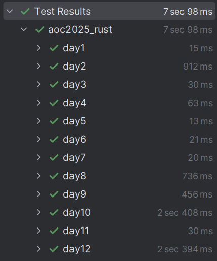
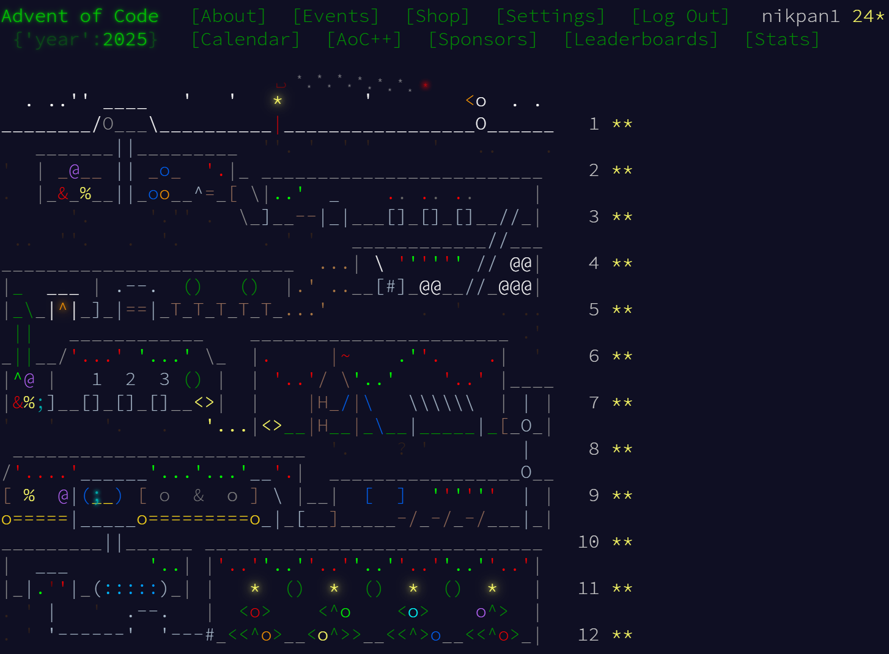

# Advent of Code 2025 - Rust
# **_Spoiler: Screenshot of the final calendar is at the bottom of this readme!!!_**

This repository contains my solutions for the Advent of Code 2025 programming puzzles, written in Rust.

## Tests

Everything works(somehow :D):



## Project Structure

The project is organized by day, with each day having its own module. Each module contains the solution for both parts of the puzzle, as well as the input file.

```
src
├── day1
│   ├── input.txt
│   ├── mod.rs
│   ├── part1.rs
│   └── part2.rs
├── day2
...
```

## Final Calendar Screenshot
<br>
<br>
<br>
<br>
<br>
<br>
<br>
<br>
<br>
<br>
<br>
<br>
<br>
<br>
<br>
<br>
<br>
<br>
<br>
<br>
<br>
<br>
<br>
<br>
<br>
<br>
<br>
<br>
<br>
<br>
<br>
<br>
<br>
<br>
<br>
<br>
<br>
<br>
<br>
<br>
<br>
<br>
<br>
<br>
<br>
<br>
<br>
<br>
<br>
<br>
<br>
<br>
<br>
<br>
<br>
<br>
<br>
<br>
<br>
<br>
<br>
<br>
<br>
<br>
<br>
<br>
<br>
<br>
<br>
<br>
<br>
<br>
<br>
<br>
<br>
<br>
<br>
<br>
<br>
<br>
<br>
<br>
<br>
<br>
<br>
<br>
<br>
<br>


